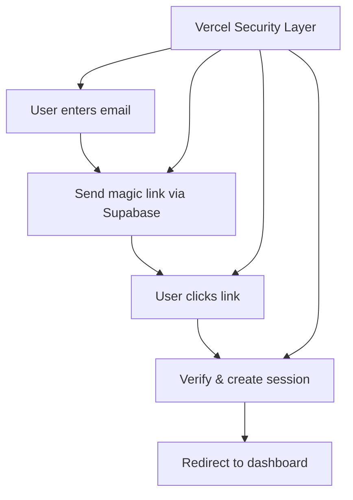

# TableLink Authentication: The Simplified Plan

## Overview
Leverage Vercel's built-in security + Supabase Auth to create a simple, secure authentication system that can be implemented in 2-3 days.

## Core Principles
- **Let Vercel handle security** (bot detection, DDoS, rate limiting)
- **Use Supabase defaults** (they're battle-tested)
- **Ship fast, iterate later**
- **No premature optimization**

## 1. Authentication Flow



## 2. File Structure (Minimal)

```
app/
├── auth/
│   ├── page.tsx              # Login page
│   └── callback/route.ts     # Magic link handler
├── api/
│   └── auth/
│       └── magic-link/route.ts
├── dashboard/
│   └── page.tsx              # Protected page
├── (public)/
│   └── app/[restaurant]/     # Guest menu view
└── middleware.ts             # Auth checks
```

## 3. Implementation

### 3.1 Magic Link Endpoint (15 lines)

```typescript
// app/api/auth/magic-link/route.ts
import { createRouteHandlerClient } from '@supabase/auth-helpers-nextjs';
import { cookies } from 'next/headers';
import { NextResponse } from 'next/server';

export async function POST(req: Request) {
  const { email } = await req.json();
  const supabase = createRouteHandlerClient({ cookies });
  
  const { error } = await supabase.auth.signInWithOtp({
    email,
    options: {
      emailRedirectTo: `${process.env.NEXT_PUBLIC_URL}/auth/callback`,
    }
  });
  
  if (error) {
    return NextResponse.json({ error: error.message }, { status: 400 });
  }
  
  return NextResponse.json({ success: true });
}
```

### 3.2 Callback Handler (20 lines)

```typescript
// app/auth/callback/route.ts
import { createRouteHandlerClient } from '@supabase/auth-helpers-nextjs';
import { cookies } from 'next/headers';
import { NextRequest, NextResponse } from 'next/server';

export async function GET(req: NextRequest) {
  const requestUrl = new URL(req.url);
  const code = requestUrl.searchParams.get('code');
  
  if (code) {
    const supabase = createRouteHandlerClient({ cookies });
    await supabase.auth.exchangeCodeForSession(code);
    
    // Check if user needs onboarding
    const { data: { user } } = await supabase.auth.getUser();
    const { data: restaurant } = await supabase
      .from('restaurants')
      .select('id')
      .eq('owner_id', user?.id)
      .single();
    
    const redirectTo = restaurant ? '/dashboard' : '/onboarding';
    return NextResponse.redirect(new URL(redirectTo, req.url));
  }
  
  return NextResponse.redirect(new URL('/auth', req.url));
}
```

### 3.3 Simple Middleware (30 lines)

```typescript
// middleware.ts
import { createMiddlewareClient } from '@supabase/auth-helpers-nextjs';
import { NextRequest, NextResponse } from 'next/server';

export async function middleware(req: NextRequest) {
  const res = NextResponse.next();
  const supabase = createMiddlewareClient({ req, res });
  
  // Public routes - no auth needed
  const isPublicRoute = req.nextUrl.pathname.startsWith('/app/') || 
                       req.nextUrl.pathname === '/' ||
                       req.nextUrl.pathname.startsWith('/auth');
  
  if (isPublicRoute) {
    return res;
  }
  
  // Check auth for protected routes
  const { data: { session } } = await supabase.auth.getSession();
  
  if (!session && req.nextUrl.pathname.startsWith('/dashboard')) {
    return NextResponse.redirect(new URL('/auth', req.url));
  }
  
  return res;
}

export const config = {
  matcher: ['/((?!_next/static|_next/image|favicon.ico).*)']
};
```

### 3.4 Login Page (50 lines)

```tsx
// app/auth/page.tsx
'use client';

import { useState } from 'react';
import { Button } from '@/components/ui/button';
import { Input } from '@/components/ui/input';
import { toast } from 'sonner';

export default function AuthPage() {
  const [email, setEmail] = useState('');
  const [loading, setLoading] = useState(false);
  const [sent, setSent] = useState(false);

  const handleSubmit = async (e: React.FormEvent) => {
    e.preventDefault();
    setLoading(true);

    const res = await fetch('/api/auth/magic-link', {
      method: 'POST',
      headers: { 'Content-Type': 'application/json' },
      body: JSON.stringify({ email })
    });

    setLoading(false);

    if (res.ok) {
      setSent(true);
      toast.success('Check your email for the login link!');
    } else {
      const { error } = await res.json();
      toast.error(error || 'Something went wrong');
    }
  };

  if (sent) {
    return (
      <div className="max-w-md mx-auto mt-20 text-center">
        <h1 className="text-2xl font-bold mb-4">Check your email</h1>
        <p className="text-muted-foreground">
          We sent a login link to {email}
        </p>
      </div>
    );
  }

  return (
    <form onSubmit={handleSubmit} className="max-w-md mx-auto mt-20">
      <h1 className="text-2xl font-bold mb-6">Sign in to TableLink</h1>
      <Input
        type="email"
        placeholder="your@email.com"
        value={email}
        onChange={(e) => setEmail(e.target.value)}
        required
        className="mb-4"
      />
      <Button type="submit" className="w-full" disabled={loading}>
        {loading ? 'Sending...' : 'Send login link'}
      </Button>
    </form>
  );
}
```

## 4. Database Schema (Essential Only)

```sql
-- Users handled by Supabase Auth

-- Restaurants (multi-tenant)
CREATE TABLE restaurants (
  id UUID PRIMARY KEY DEFAULT gen_random_uuid(),
  name VARCHAR(255) NOT NULL,
  slug VARCHAR(100) UNIQUE NOT NULL,
  owner_id UUID REFERENCES auth.users(id),
  settings JSONB DEFAULT '{}',
  created_at TIMESTAMPTZ DEFAULT NOW()
);

-- Restaurant access
CREATE TABLE restaurant_members (
  restaurant_id UUID REFERENCES restaurants(id) ON DELETE CASCADE,
  user_id UUID REFERENCES auth.users(id) ON DELETE CASCADE,
  role VARCHAR(50) DEFAULT 'member',
  created_at TIMESTAMPTZ DEFAULT NOW(),
  PRIMARY KEY (restaurant_id, user_id)
);

-- Menus
CREATE TABLE menus (
  id UUID PRIMARY KEY DEFAULT gen_random_uuid(),
  restaurant_id UUID REFERENCES restaurants(id) ON DELETE CASCADE,
  name VARCHAR(255),
  data JSONB NOT NULL,
  active BOOLEAN DEFAULT true,
  created_at TIMESTAMPTZ DEFAULT NOW(),
  updated_at TIMESTAMPTZ DEFAULT NOW()
);

-- Usage tracking (for billing)
CREATE TABLE usage_logs (
  id UUID PRIMARY KEY DEFAULT gen_random_uuid(),
  restaurant_id UUID REFERENCES restaurants(id),
  type VARCHAR(50), -- 'menu_query', 'menu_extraction'
  metadata JSONB,
  created_at TIMESTAMPTZ DEFAULT NOW()
);

-- GDPR consent (legal requirement)
CREATE TABLE gdpr_consents (
  id UUID PRIMARY KEY DEFAULT gen_random_uuid(),
  user_id UUID REFERENCES auth.users(id),
  email VARCHAR(255),
  privacy_accepted BOOLEAN DEFAULT false,
  marketing_emails BOOLEAN DEFAULT false,
  accepted_at TIMESTAMPTZ DEFAULT NOW()
);

-- Enable RLS
ALTER TABLE restaurants ENABLE ROW LEVEL SECURITY;
ALTER TABLE restaurant_members ENABLE ROW LEVEL SECURITY;
ALTER TABLE menus ENABLE ROW LEVEL SECURITY;

-- Basic RLS policies
CREATE POLICY "Users can view their restaurants" ON restaurants
  FOR SELECT USING (owner_id = auth.uid() OR 
    EXISTS (
      SELECT 1 FROM restaurant_members 
      WHERE restaurant_id = restaurants.id 
      AND user_id = auth.uid()
    )
  );
```

## 5. Onboarding Flow (Simple)

```tsx
// app/onboarding/page.tsx
'use client';

import { useState } from 'react';
import { useRouter } from 'next/navigation';
import { createClientComponentClient } from '@supabase/auth-helpers-nextjs';

export default function OnboardingPage() {
  const [restaurantName, setRestaurantName] = useState('');
  const [loading, setLoading] = useState(false);
  const router = useRouter();
  const supabase = createClientComponentClient();

  const handleSubmit = async (e: React.FormEvent) => {
    e.preventDefault();
    setLoading(true);

    const { data: { user } } = await supabase.auth.getUser();
    const slug = restaurantName.toLowerCase().replace(/\s+/g, '-');

    const { error } = await supabase
      .from('restaurants')
      .insert({
        name: restaurantName,
        slug,
        owner_id: user?.id
      });

    if (!error) {
      // Record GDPR consent
      await supabase
        .from('gdpr_consents')
        .insert({
          user_id: user?.id,
          email: user?.email,
          privacy_accepted: true,
          marketing_emails: false
        });

      router.push('/dashboard');
    }
    
    setLoading(false);
  };

  return (
    <form onSubmit={handleSubmit} className="max-w-md mx-auto mt-20">
      <h1 className="text-2xl font-bold mb-6">Welcome to TableLink!</h1>
      <input
        type="text"
        placeholder="Restaurant name"
        value={restaurantName}
        onChange={(e) => setRestaurantName(e.target.value)}
        required
        className="w-full p-2 border rounded mb-4"
      />
      <button 
        type="submit" 
        disabled={loading}
        className="w-full bg-primary text-white p-2 rounded"
      >
        {loading ? 'Creating...' : 'Create restaurant'}
      </button>
    </form>
  );
}
```

## 6. Security Configuration

### 6.1 Enable Vercel Protection (30 seconds)
```bash
# In Vercel Dashboard:
# 1. Go to Project Settings → Firewall
# 2. Enable "Bot Protection" ✅
# 3. Enable "DDoS Protection" ✅
# Done!
```

### 6.2 Environment Variables
```env
# .env.local
NEXT_PUBLIC_SUPABASE_URL=your-project-url
NEXT_PUBLIC_SUPABASE_ANON_KEY=your-anon-key
NEXT_PUBLIC_URL=http://localhost:3000

# Production
NEXT_PUBLIC_URL=https://app.tablelink.be
```

### 6.3 Supabase Email Template
```html
<!-- Customize in Supabase Dashboard → Authentication → Email Templates -->
<h2>Sign in to TableLink</h2>
<p>Click below to sign in:</p>
<a href="{{ .ConfirmationURL }}">Sign in to TableLink</a>
<p>This link expires in 5 minutes.</p>
```

## 7. Multi-Tenant Data Access

```typescript
// lib/supabase/queries.ts
export async function getRestaurantData(restaurantId: string) {
  const supabase = createServerClient();
  
  // RLS automatically filters based on auth.uid()
  const { data, error } = await supabase
    .from('restaurants')
    .select(`
      *,
      menus (*)
    `)
    .eq('id', restaurantId)
    .single();
    
  return { data, error };
}

// Helper to get current restaurant
export async function getCurrentRestaurant() {
  const supabase = createServerClient();
  const { data: { user } } = await supabase.auth.getUser();
  
  const { data } = await supabase
    .from('restaurants')
    .select('*')
    .eq('owner_id', user?.id)
    .single();
    
  return data;
}
```

## 8. Usage Tracking (For Billing)

```typescript
// lib/usage.ts
export async function trackUsage(
  restaurantId: string, 
  type: 'menu_query' | 'menu_extraction'
) {
  const supabase = createServerClient();
  
  await supabase
    .from('usage_logs')
    .insert({
      restaurant_id: restaurantId,
      type,
      metadata: {
        timestamp: new Date().toISOString(),
        // Add any relevant metadata
      }
    });
}

// Check limits
export async function checkUsageLimits(restaurantId: string) {
  const supabase = createServerClient();
  
  const startOfMonth = new Date();
  startOfMonth.setDate(1);
  startOfMonth.setHours(0, 0, 0, 0);
  
  const { count } = await supabase
    .from('usage_logs')
    .select('*', { count: 'exact', head: true })
    .eq('restaurant_id', restaurantId)
    .gte('created_at', startOfMonth.toISOString());
    
  return {
    queries: count || 0,
    limit: 1000 // Based on plan
  };
}
```

## 9. Timeline

### Day 1: Core Auth (4 hours)
- [ ] Set up Supabase project
- [ ] Implement magic link endpoint
- [ ] Create callback handler
- [ ] Add middleware
- [ ] Test auth flow

### Day 2: Multi-tenancy (4 hours)
- [ ] Create database schema
- [ ] Set up RLS policies
- [ ] Build onboarding flow
- [ ] Add restaurant context
- [ ] Test tenant isolation

### Day 3: Polish & Deploy (4 hours)
- [ ] Enable Vercel security
- [ ] Add error handling
- [ ] Create loading states
- [ ] Deploy to production
- [ ] Test in production

## 10. What We're NOT Building

❌ Custom bot detection (Vercel handles it)  
❌ Rate limiting code (Vercel handles it)  
❌ IP tracking (Vercel logs it)  
❌ Device fingerprinting  
❌ Complex session management  
❌ Password auth (magic links only)  
❌ 2FA (can add later)  
❌ OAuth providers (can add later)  

## 11. Monitoring & Analytics

```typescript
// Use Vercel Analytics (built-in)
import { track } from '@vercel/analytics';

// Track key events
track('user_signup', { method: 'magic_link' });
track('restaurant_created');
track('menu_uploaded');
```

## 12. Future Enhancements (After Launch)

1. **Month 2**: Add team invites
2. **Month 3**: Add OAuth (Google/Microsoft)
3. **Month 6**: Add 2FA for enterprise
4. **Month 12**: Add SSO support

## The Bottom Line

This simplified plan:
- **3 days to implement** (vs 2 weeks)
- **~200 lines of code** (vs 2000+)
- **Leverages platform security** (Vercel + Supabase)
- **Focuses on core value** (menu AI, not auth complexity)
- **Can scale to thousands of users** without changes

Ship this, get customers, iterate based on real needs! 🚀

## Implementation Status (Updated January 2025)

### ✅ Completed Features

1. **Core Authentication**
   - Magic link authentication via Supabase
   - @supabase/ssr integration (latest approach)
   - Secure session management
   - Internationalization support in auth flow
   - Custom email templates with Culi branding

2. **UI Components**
   - Custom shadcn/ui components (Input, Label, Form)
   - Sonner for toast notifications
   - Consistent styling with Culi brand colors
   - Responsive design
   - Form validation with React Hook Form + Zod

3. **Multi-tenancy**
   - Restaurant-based isolation
   - Team member support (restaurant_members table)
   - RLS policies for data security
   - Usage tracking per restaurant
   - Owner-based access control

4. **Pages & Routes**
   - `/[locale]/auth` - Login page with magic link
   - `/[locale]/auth/callback` - OAuth callback handler
   - `/[locale]/onboarding` - Restaurant setup with GDPR consent
   - `/[locale]/dashboard` - Protected dashboard with stats
   - `/api/auth/magic-link` - Magic link endpoint

5. **Middleware**
   - Integrated auth checks with i18n
   - Protected route handling
   - Automatic redirects
   - Session refresh on navigation

6. **Database Schema**
   - All tables from original plan
   - Additional auth tables (restaurant_members, gdpr_consents, usage_logs)
   - Helper functions for multi-tenant access
   - RLS policies with proper indexes

7. **Email Templates**
   - Professional magic link template (`/docs/email-templates/magic-link.html`)
   - Modern gradient design template (`/docs/email-templates/magic-link-modern.html`)
   - Both templates use Culi's color scheme and branding

### 🚧 Next Steps

1. **Immediate (Week 1)**
   - [ ] Deploy to production
   - [ ] Configure Supabase email templates (use `/docs/email-templates/` designs)
   - [ ] Add loading skeletons to dashboard
   - [ ] Create QR code generation page
   - [ ] End-to-end testing of auth flow

2. **Short Term (Month 1)**
   - [ ] Menu upload functionality with AI extraction
   - [ ] Basic analytics dashboard with charts
   - [ ] Team invite system with role management
   - [ ] Email notifications for key events
   - [ ] Password reset flow

3. **Medium Term (Months 2-3)**
   - [ ] OAuth providers (Google, Microsoft)
   - [ ] Advanced analytics with export
   - [ ] API access for premium tier
   - [ ] Webhook integrations
   - [ ] Two-factor authentication (2FA)
   - [ ] Session management UI

### 📁 File Structure

```
app/
├── [locale]/
│   ├── auth/
│   │   ├── page.tsx              # Login page ✅
│   │   └── callback/route.ts     # Magic link handler ✅
│   ├── onboarding/page.tsx       # Restaurant setup ✅
│   └── dashboard/page.tsx        # Main dashboard ✅
├── api/
│   └── auth/
│       └── magic-link/route.ts   # Send magic link ✅
├── components/ui/
│   ├── input.tsx                 # Custom input ✅
│   ├── label.tsx                 # Custom label ✅
│   ├── form.tsx                  # Form components ✅
│   └── toaster.tsx               # Toast notifications ✅
lib/
├── supabase/
│   ├── server.ts                 # Server-side client ✅
│   ├── browser.ts                # Browser client ✅
│   ├── client.ts                 # Legacy client ✅
│   └── queries.ts                # Helper functions ✅
middleware.ts                      # Auth + i18n middleware ✅
supabase/migrations/
├── 20250108_initial_schema.sql   # Base schema ✅
└── 20250109_auth_multi_tenancy.sql # Auth updates ✅
docs/email-templates/
├── magic-link.html               # Professional email template ✅
└── magic-link-modern.html        # Modern gradient email template ✅
```

### 🔑 Key Decisions Made

1. **@supabase/ssr over auth-helpers** - Using the latest recommended approach
2. **Magic links only** - No password complexity to manage
3. **Middleware integration** - Auth works seamlessly with i18n
4. **GDPR from day one** - Consent tracking built-in
5. **Multi-tenant ready** - Restaurant isolation implemented

### 🛡️ Security Considerations

- ✅ RLS policies on all tables
- ✅ Session management via Supabase
- ✅ GDPR consent tracking
- ✅ No sensitive data in client
- ✅ Vercel security features enabled
- ✅ Environment variables properly configured

### 📊 Performance Optimizations

- Server components where possible
- Parallel data fetching in dashboard
- Minimal client-side JavaScript
- Efficient RLS policies with indexes
- Pre-aggregated analytics

### 🐛 Known Issues

- Team invite requires user to exist (sign up first)
- Analytics aggregation needs scheduled job setup
- Email templates need to be configured in Supabase dashboard

### 📧 Email Template Configuration

To apply the custom email templates:

1. **Go to Supabase Dashboard** → Authentication → Email Templates
2. **Select "Magic Link" template**
3. **Copy the HTML** from either:
   - `/docs/email-templates/magic-link.html` (Professional design)
   - `/docs/email-templates/magic-link-modern.html` (Modern gradient design)
4. **Available template variables**:
   - `{{ .ConfirmationURL }}` - The magic link URL
   - `{{ .Token }}` - The 6-digit OTP code
   - `{{ .SiteURL }}` - Your site URL
   - `{{ .Email }}` - User's email address

### 🔄 Future Enhancements

1. **Authentication**
   - Social login (Google, Apple, Microsoft)
   - Two-factor authentication
   - Passwordless phone auth
   - SSO for enterprise
   - Session management UI

2. **User Experience**
   - Remember me functionality
   - Device management
   - Login history
   - Security alerts
   - Customizable auth pages per restaurant

3. **Team Management**
   - Role-based permissions (owner, manager, staff)
   - Bulk invites
   - Team activity logs
   - Permission templates
   - Cross-restaurant access

4. **Security**
   - Advanced rate limiting
   - Suspicious activity detection
   - IP allowlisting for enterprise
   - Audit logs
   - Compliance certifications (SOC2, ISO)

5. **Integration**
   - Webhook events for auth actions
   - API keys for service accounts
   - OAuth2 provider (let others auth with Culi)
   - SAML support
   - LDAP/Active Directory sync

This implementation provides a solid foundation for Culi's authentication system while maintaining simplicity and security. The modular design allows for easy enhancement as the platform grows.